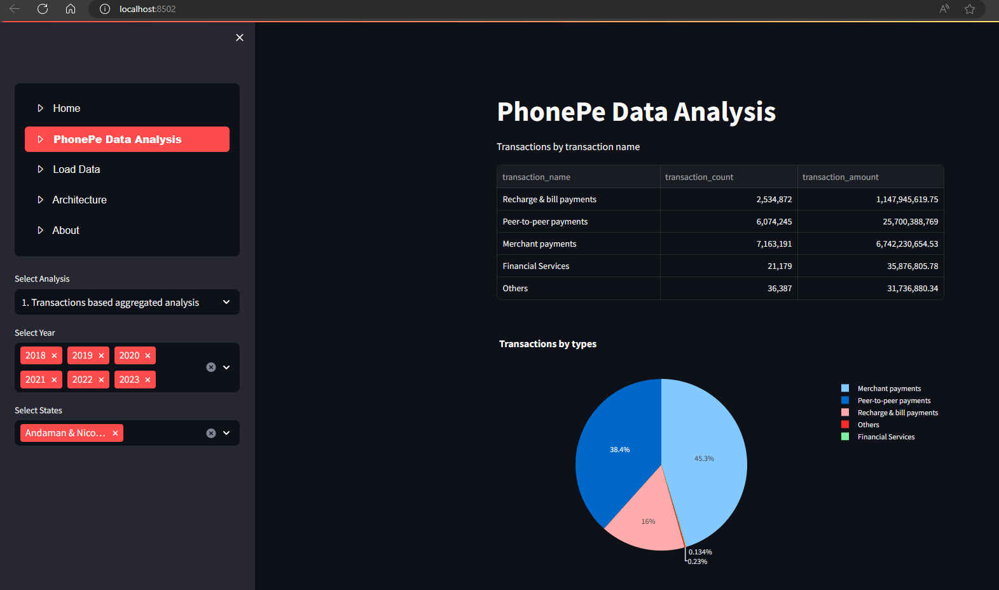

# PhonePe Pulse data Analytics

This project is to load phonepe pulse data into mysql and do descriptive analytics and slicing and dicing of data.

To execute this project we can use viewer.py as below:

>$streamlit run viewer.py

## requirements.txt:

 - pandas
 - streamlit
 - streamlit-option-menu
 - mysqlclient
 - mysql-connector
 - mysql-connector-python
 - sqlalchemy
 - plotly
 - matplotlib

## Screenshots

  

Analysis by States using Map

  

Analysis by Users by Years

  

In to-be state these mysql sql data warehouse will be moved to snowflake cloud datawarehouse by extending this project.

## About

Kannan Kandasamy

 - You can reach me at  kannanvijay@hotmail.com
 - Stackoverflow        https://stackoverflow.com/users/6466279/kannan-kandasamy
 - LinkedIn             https://www.linkedin.com/in/kannankandasamy/
 - Git                  https://github.com/kannankandasamy

